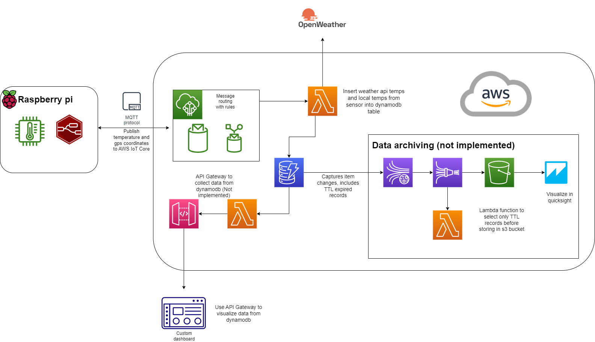
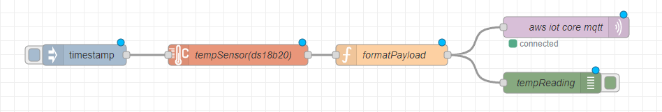

# TempToCloud_IoT

## Use case

Compare local temperature with data from OpenWeather API to see difference and accuracy of live temperature readings from the API.

## Project architecture

### Raspberry pi

Publishing temperature data from a DS18B20 to a mqtt topic using node-red running on a raspberry Pi. Adding timestamp and hardcoded gps coordinates before publishing. Using MQTT with TLS for secure connection, certificates provided by AWS IoT Core.

### Lambda function for data insertion

Triggered by IoT rule in AWS IoT Core. Recieves sensor data and coordinates from message routing and retrieves data from Openweathermap weather API. Inserts data into dynamodb table. Stores API Key and dynamodb table name as environmental variables and uses default encryption provided with AWS Key Management Service. This could be made more secure by storing API Key in AWS Secrets Manager.

### Data storage and visualization

DyanamoDB used for newer data and visualized with custom dashboard accesing database through API Gateway. Archiving of data is done with Time To Live in dynamodb and then exporting that data to a S3 Bucket. Visualize archived data with Quicksight connecting directly to S3 bucket. 

Quicksight example showing temperature difference between local data and weather API (Using fake data):

