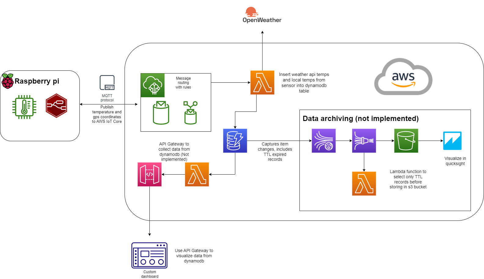

# TempToCloud_IoT

## Use case

Compare local temperature with data from OpenWeather API to see difference and accuracy of live temperature readings from the API.

## Project architecture

### Raspberry pi

Publishing temperature data from a DS18B20 to a mqtt topic using node-red running on a raspberry Pi. Adding timestamp and hardcoded gps coordinates before publishing. Using MQTT with TLS for secure connection, certificates provided by AWS IoT Core.

### Lambda function for data insertion

Triggered by IoT rule in AWS IoT Core. Recieves sensor data and coordinates from message routing and retrieves data from Openweathermap weather API. Inserts data into dynamodb table. Stores API Key and dynamodb table name as environmental variables and uses default encryption provided with AWS Key Management Service.
